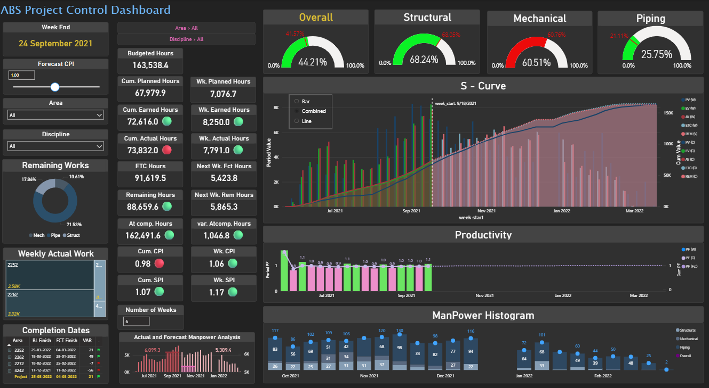

# ABS Project Control Dashboard (Power BI)

## Project Full Form
ABS – Activity-Based Scheduling

---

## 📊 Project Overview
The ABS Project Control Dashboard is an end-to-end Power BI analytics solution designed to monitor, control, and forecast project performance using Earned Value Management (EVM) principles.

This dashboard provides a single-page management view to analyze planned, earned, and actual performance, cost and schedule efficiency, productivity trends, manpower utilization, remaining work, and forecasted project completion using weekly time-phased data.  
The project is modeled to reflect a real-world Construction / EPC project environment.

---

## 🎯 Business Objectives
- Track Planned, Earned, and Actual Hours
- Measure Cost Performance Index (CPI) and Schedule Performance Index (SPI)
- Analyze project progress trends using S-Curve
- Monitor discipline-wise execution performance
- Forecast remaining effort and project completion
- Enable data-driven project decision-making

---

## 🧱 Project Scope
Industry: Construction / EPC / Industrial Projects  
Methodology: Earned Value Management (EVM)  
Time Granularity: Weekly  

Disciplines Covered:
- Structural
- Mechanical
- Piping

---

## 📂 Data Model Overview
Baseline (Planned Value – PV):  
Represents budgeted / planned hours for all activities and supports planned performance tracking.

Earned Value (EV):  
Represents the value of work physically completed, calculated using approved percentage progress and measured in planned hours.

Actual Value (AV):  
Represents the actual hours spent to execute the work and reflects real effort consumed.

Remaining Work:  
Represents balance hours yet to be completed.

Estimate to Complete (ETC):  
Represents forecasted remaining effort, dynamically adjusted using forecast CPI.

Lookup Tables:  
Used for discipline classification and project structure mapping.

---

## 📐 Key Performance Metrics & Logic

Planned Value (PV):  
What was originally planned or budgeted for the work.

Earned Value (EV):  
What portion of the planned work has been physically completed.

EV = Planned Hours × % Physical Completion

Actual Value (AV):  
How many hours were actually spent to complete the work.

---

Cost Performance Index (CPI):  
Measures cost efficiency.

CPI = Earned Value / Actual Value

CPI > 1 → Cost efficient  
CPI < 1 → Cost overrun  

---

Schedule Performance Index (SPI):  
Measures schedule efficiency.

SPI = Earned Value / Planned Value

SPI > 1 → Ahead of schedule  
SPI < 1 → Behind schedule  

---

Estimate to Complete (ETC):  
Forecasts remaining effort required to complete the project.

ETC = Remaining Hours / Forecast CPI

---

## 📈 Dashboard Visuals
- Overall Project Progress Gauge
- Discipline-wise Progress Gauges
- Planned vs Earned vs Actual S-Curve
- Weekly Productivity Trend
- Remaining Work Donut Chart
- Weekly Actual Work Bar Chart
- Manpower Histogram
- Forecast Completion Comparison Table

---

## 🧮 DAX Measures & Calculations
The dashboard uses more than 80 DAX measures and calculated columns to support:
- Earned Value Management (PV, EV, AV)
- CPI & SPI (weekly and cumulative)
- Forecasting and ETC calculations
- Productivity and manpower analysis
- Discipline-wise and overall performance tracking

Key DAX concepts used:
- CALCULATE
- FILTER
- DIVIDE
- SUMX
- Variables
- Time-intelligence patterns

---

## 👷 Manpower & Productivity Analysis
Manpower is derived from actual hours.

Productivity is calculated as:
Productivity = Earned Hours / Actual Hours

Baseline productivity = 1.0

---

## 🎯 Target Audience
- Project Managers
- Planning / Project Control Engineers
- Management and Client Review Teams

---

## 🛠 Tools & Technologies
- Power BI Desktop
- DAX
- Data Modeling
- Project Control and EVM Concepts

---

## 📷 Dashboard Preview

---

## 🚀 Key Outcomes
- Clear visibility into project performance
- Early detection of schedule and cost risks
- Improved manpower planning
- Reliable forecasting of remaining work
- Management-ready insights for decision-making

---

## 📌 Author
Thirupal B
Junior Data Analyst  
Power BI | SQL | Data Analytics
